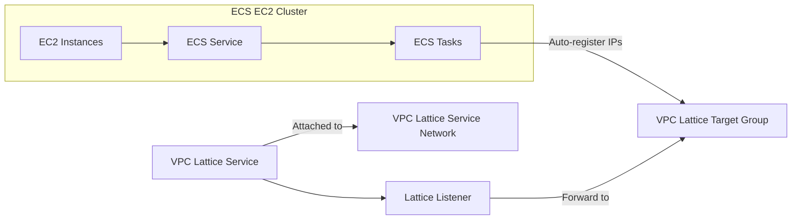

# Executive Summary

This design outlines a Terraform module that deploys an **Amazon ECS (EC2 launch type) service** integrated with **AWS VPC Lattice**. The module assumes an existing ECS cluster (ARN provided as input) and a VPC Lattice Service (ID provided). It creates the ECS **Task Definition** and **Service** (on Amazon EC2 instances), a VPC Lattice **Target Group** and **Listener**, and associates them via the Lattice service network. This native integration lets ECS tasks (as IP targets) be fronted by VPC Lattice without an ALB【56†L47-L54】【18†L18-L24】. 

Key components:
- **ECS Task Definition and Service (EC2)**: Defines the container image, CPU/memory, network mode (`awsvpc`), and runs tasks on EC2 instances. The service includes a `vpc_lattice_configurations` block to attach the VPC Lattice target group.
- **VPC Lattice Resources**: A *target group* (type IP) collects ECS task IPs; a *listener* forwards traffic to that target group; and a *service-network association* joins the service to the service network.
- **IAM and Security**: We create minimal IAM roles: an ECS execution role, a task role (with `vpc-lattice-svcs:Invoke` permission so tasks can call Lattice services【29†L457-L465】), and an ECS infrastructure role trusting `ecs.amazonaws.com` with only the `AmazonECSInfrastructureRolePolicyForVpcLattice` policy【24†L28-L31】【31†L1-L4】. Security groups allow only VPC Lattice traffic (using AWS’s managed Lattice prefix list) into the tasks. This **zero-trust** setup ensures least privilege.

The report details the Terraform module structure, variables, outputs, and code snippets for EC2-based ECS and VPC Lattice, along with IAM policy JSON examples. A table summarizes resources and a Mermaid diagram illustrates the architecture. Finally, we provide a testing and hardening checklist tailored for ECS on EC2. All content is grounded in AWS documentation and Terraform provider references【18†L18-L24】【24†L28-L31】【29†L457-L465】【54†L1-L4】.

## Resource Summary and Purpose

| **Resource**                                        | **Terraform Resource**                                   | **Purpose**                                                       |
|-----------------------------------------------------|---------------------------------------------------------|-------------------------------------------------------------------|
| ECS Task Definition                                | `aws_ecs_task_definition`                                | Defines containers (image, CPU/mem, port mappings, logging).      |
| ECS Service (EC2)                                  | `aws_ecs_service`                                       | Runs tasks on EC2 instances, uses `awsvpc` network mode; attaches to VPC Lattice target group. |
| VPC Lattice Target Group (IP)                      | `aws_vpclattice_target_group`                           | Holds ECS task IPs as load-balancing targets.                     |
| VPC Lattice Listener                               | `aws_vpclattice_listener`                               | Listens on a port (HTTP/HTTPS) and forwards requests to target group. |
| VPC Lattice Service-Network Association            | `aws_vpclattice_service_network_service_association`    | Associates the Lattice service with the service network for access. |
| IAM Role (ECS Task Execution)                      | `aws_iam_role`, `aws_iam_role_policy_attachment`        | Role for ECS agent to pull images and write logs (uses managed policy). |
| IAM Role (ECS Task)                                | `aws_iam_role`, `aws_iam_policy`, `aws_iam_role_policy_attachment` | Application task role; granted only necessary permissions (e.g. `vpc-lattice-svcs:Invoke`). |
| IAM Role (ECS Infrastructure for Lattice)          | `aws_iam_role`, `aws_iam_role_policy_attachment`        | Trusted by ECS (`ecs.amazonaws.com`) to manage Lattice target groups (policy: `AmazonECSInfrastructureRolePolicyForVpcLattice`)【24†L28-L31】. |
| Security Groups                                    | (User-provided)                                         | Restricts task inbound to only the VPC Lattice prefix list on container port【54†L1-L4】. |
| CloudWatch Log Group (optional create)             | `aws_cloudwatch_log_group`                              | Stores container logs for ECS tasks.                              |

This table clarifies how each AWS resource contributes to running the ECS service with VPC Lattice integration. The ECS service’s **network_mode** is set to `awsvpc`, so each task gets an ENI. ECS automatically registers these task IPs in the VPC Lattice target group【18†L18-L24】, enabling Lattice to route traffic to the tasks.

## Terraform Module Structure

```
ecs-lattice-ec2-module/
├── main.tf            # ECS, VPC Lattice, IAM, SG, etc.
├── variables.tf       # Input variables
├── outputs.tf         # Output values (ARNs, IDs)
├── iam.tf             # (optional) dedicated IAM resources
├── example_usage.tf   # Example of how to call the module
└── README.md         # (optional) documentation
```

- **variables.tf** defines inputs (all unspecified values become variables): 
  - `cluster_arn`, `service_name`, `container_image`, `container_port`, `container_port_name`, `cpu`, `memory`, `desired_count`, `subnets`, `security_group_ids`, `vpc_id`, `vpclattice_service_id`, `service_network_id`, `listener_port`, `log_group_name`, plus optional `execution_role_arn`, `task_role_arn`, `instance_role_arn`, and `tags`.

- **main.tf** declares resources using these variables. 
- **outputs.tf** returns the ECS service ARN, task def ARN, Lattice target group ARN, listener ID, association ID, and IAM role ARNs.

Example usage snippet:

```hcl
module "ecs_lattice_service" {
  source              = "./ecs-lattice-ec2-module"
  cluster_arn         = aws_ecs_cluster.main.arn
  service_name        = "my-ec2-service"
  container_image     = "123456789012.dkr.ecr.us-east-1.amazonaws.com/myapp:latest"
  container_port      = 8080
  container_port_name = "http"                   # must match TaskDefinition portMapping name
  cpu                 = 512
  memory              = 1024
  desired_count       = 2
  subnets             = [aws_subnet.sub1.id, aws_subnet.sub2.id]
  security_group_ids  = [aws_security_group.ecs_tasks.id]
  vpc_id              = "vpc-0123456789abcdef0"
  vpclattice_service_id = "svc-0abc1234def5678gh"
  service_network_id  = "sn-0hijk5678lmn9012op"
  listener_port       = 80
  log_group_name      = "/ecs/my-ec2-service"
  tags = { Environment = "prod" }
}
```

This module call tells Terraform to create the ECS service (using existing cluster) and all Lattice resources linking that service to the given VPC Lattice service.  

## ECS Task Definition & Service (EC2 Launch Type)

```hcl
resource "aws_iam_role" "ecs_execution_role" {
  name = "${var.service_name}-ecs-exec-role"
  assume_role_policy = jsonencode({
    Version = "2012-10-17",
    Statement = [{
      Effect    = "Allow",
      Principal = { Service = "ecs-tasks.amazonaws.com" },
      Action    = "sts:AssumeRole"
    }]
  })
}

resource "aws_iam_role_policy_attachment" "ecs_exec_policy" {
  role       = aws_iam_role.ecs_execution_role.name
  policy_arn = "arn:aws:iam::aws:policy/service-role/AmazonECSTaskExecutionRolePolicy"
}

resource "aws_ecs_task_definition" "this" {
  family                   = var.service_name
  network_mode             = "awsvpc"
  requires_compatibilities = ["EC2"]
  cpu                      = var.cpu
  memory                   = var.memory

  execution_role_arn = var.execution_role_arn != "" ? var.execution_role_arn : aws_iam_role.ecs_execution_role.arn
  task_role_arn      = var.task_role_arn     != "" ? var.task_role_arn      : aws_iam_role.ecs_task_role.arn

  container_definitions = jsonencode([{
    name         = var.service_name
    image        = var.container_image
    cpu          = var.cpu
    memory       = var.memory
    essential    = true
    portMappings = [{
      containerPort = var.container_port
      name          = var.container_port_name
      protocol      = "tcp"
    }]
    logConfiguration = {
      logDriver = "awslogs"
      options = {
        "awslogs-group"         = var.log_group_name
        "awslogs-region"        = data.aws_region.current.name
        "awslogs-stream-prefix" = var.service_name
      }
    }
  }])
}

data "aws_region" "current" {}
```

- **network_mode** = `awsvpc` gives each task its own ENI on EC2. ECS will register that ENI’s IP into the Lattice target group【18†L18-L24】. 
- **requires_compatibilities** = `["EC2"]` (no Fargate). 
- We create an ECS *execution role* (trusted by `ecs-tasks.amazonaws.com`) and attach AWS’s `AmazonECSTaskExecutionRolePolicy` (which allows ECR pulls and CloudWatch Logs)【24†L28-L31】.
- If the user passes `execution_role_arn` or `task_role_arn`, those are used; otherwise the module creates its own roles.

## VPC Lattice Configuration in ECS Service

```hcl
resource "aws_ecs_service" "this" {
  name            = var.service_name
  cluster         = var.cluster_arn
  task_definition = aws_ecs_task_definition.this.arn
  launch_type     = "EC2"
  desired_count   = var.desired_count

  network_configuration {
    subnets         = var.subnets
    security_groups = var.security_group_ids
    assign_public_ip = false
  }

  vpc_lattice_configurations {
    port_name         = var.container_port_name
    target_group_arn  = aws_vpclattice_target_group.this.arn
    role_arn          = aws_iam_role.ecs_infra.arn
  }

  depends_on = [aws_iam_role_policy_attachment.infra_vpclattice]
}
```

Key points:
- **launch_type = "EC2"**: Tasks run on EC2 instances in the cluster.
- The `vpc_lattice_configurations` block integrates Lattice: specify the *port name* (matching the TaskDef), the target group ARN, and the IAM *infrastructure role ARN*. ECS will then automatically register the tasks’ IPs into that Lattice target group【18†L18-L24】.
- `role_arn` must be an ECS infra role (see IAM below) that allows target registration. We ensure that with `depends_on`.
- We do *not* use `load_balancer` settings or an ALB here; VPC Lattice replaces that layer【56†L47-L54】.

## VPC Lattice Resources

```hcl
# Target Group for ECS tasks (IP type)
resource "aws_vpclattice_target_group" "this" {
  name           = "${var.service_name}-tg"
  type           = "IP"
  vpc_identifier = var.vpc_id
  config {
    port             = var.container_port
    protocol         = "HTTPS"
    protocol_version = "HTTP1"
    ip_address_type  = "IPV4"
    health_check {
      enabled             = true
      protocol            = "HTTPS"
      path                = "/health"
      port                = var.container_port
      healthy_threshold   = 2
      unhealthy_threshold = 3
      matcher             = { http_code = "200" }
    }
  }
}

# Listener for the Lattice service
resource "aws_vpclattice_listener" "this" {
  name               = var.service_name
  service_identifier = var.vpclattice_service_id
  protocol           = "HTTP"
  port               = var.listener_port
  default_action {
    forward {
      target_groups {
        target_group_identifier = aws_vpclattice_target_group.this.id
        weight                  = 100
      }
    }
  }
}

# Associate Lattice Service with Service Network
resource "aws_vpclattice_service_network_service_association" "this" {
  service_network_identifier = var.service_network_id
  service_identifier         = var.vpclattice_service_id
}
```

Explanation:
- We create a **VPC Lattice Target Group** of type IP in the given VPC. Its `config` uses the same port and protocol as the ECS tasks. Health checks (HTTPS on `/health`) ensure task health.
- The **Listener** listens on `listener_port` (e.g. 80 or 443) and *forwards* to the target group with weight 100 (only one TG).
- Finally, we create a **service-network association** so that the Lattice service can be reached via the specified service network (typical for cross-VPC service networks).

These match AWS's ECS-VPC Lattice pattern: ECS tasks are direct IP targets in the Lattice TG, and traffic flows ECS instances ← TG ← Listener ← Service【56†L47-L54】【18†L18-L24】.

## IAM Roles and Policies (Least Privilege)

### ECS Infrastructure Role (Lattice Target Management)

```hcl
resource "aws_iam_role" "ecs_infra" {
  name = "${var.service_name}-ecs-infra-role"
  assume_role_policy = jsonencode({
    Version = "2012-10-17",
    Statement = [{
      Sid       = "AllowECS",
      Effect    = "Allow",
      Principal = { Service = "ecs.amazonaws.com" },
      Action    = "sts:AssumeRole"
    }]
  })
}
resource "aws_iam_role_policy_attachment" "infra_vpclattice" {
  role       = aws_iam_role.ecs_infra.name
  policy_arn = "arn:aws:iam::aws:policy/service-role/AmazonECSInfrastructureRolePolicyForVpcLattice"
}
```

This role’s **trust policy** allows only ECS (`ecs.amazonaws.com`) to assume it. We attach AWS’s managed policy `AmazonECSInfrastructureRolePolicyForVpcLattice`, which grants exactly the permissions ECS needs to *register and deregister* task IPs in the VPC Lattice target group【24†L28-L31】【31†L1-L4】. No extra privileges are given. This role is referenced by the ECS service in `vpc_lattice_configurations.role_arn`.

### ECS Task Role (Application Code)

```hcl
resource "aws_iam_role" "ecs_task_role" {
  name = "${var.service_name}-ecs-task-role"
  assume_role_policy = jsonencode({
    Version = "2012-10-17",
    Statement = [{
      Effect    = "Allow",
      Principal = { Service = "ecs-tasks.amazonaws.com" },
      Action    = "sts:AssumeRole"
    }]
  })
}
resource "aws_iam_policy" "ecs_task_invoke" {
  name   = "${var.service_name}-task-invoke-policy"
  path   = "/"
  policy = jsonencode({
    Version = "2012-10-17",
    Statement = [{
      Effect   = "Allow",
      Action   = "vpc-lattice-svcs:Invoke",
      Resource = ["${var.vpclattice_service_id}", "${var.vpclattice_service_id}/*"]
    }]
  })
}
resource "aws_iam_role_policy_attachment" "ecs_task_invoke_attach" {
  role       = aws_iam_role.ecs_task_role.name
  policy_arn = aws_iam_policy.ecs_task_invoke.arn
}
```

The task role has an assume role policy for ECS tasks. We attach one inline policy granting **only** the `vpc-lattice-svcs:Invoke` action on the specific Lattice service ARN (including wildcard for its rules/actions)【29†L457-L465】. This permits the container application to call other Lattice services (using SigV4) if needed. No other permissions are granted, enforcing least privilege. 

> **Note:** If the Lattice service’s **AuthType** is set to `AWS_IAM` (recommended for zero trust), then tasks must use AWS SigV4. The above policy is required for `ecs-tasks` to be authorized. 

### ECS Task Execution Role

We created this above for pulling images/logs (`AmazonECSTaskExecutionRolePolicy`). No further adjustments are needed for Lattice. It already allows CloudWatch Logs and ECR access【24†L28-L31】.

### (Optional) EC2 Instance Role

If the ECS cluster’s EC2 instances need AWS API access (e.g. to write logs), ensure an **Instance Profile** with minimal IAM role (for CloudWatch Logs, S3, etc.). This is typically created when setting up the cluster and not needed in the module, but should be noted for completeness.

## Variables (`variables.tf` Example)

```hcl
variable "cluster_arn" {
  type        = string
  description = "ARN of the existing ECS cluster to run tasks."
}
variable "service_name" {
  type        = string
  description = "Name for the ECS service and related resources."
}
variable "container_image" {
  type        = string
  description = "Docker image URI for the container."
}
variable "container_port" {
  type        = number
  description = "Port on which the container listens."
}
variable "container_port_name" {
  type        = string
  description = "Name of the container port mapping (used by Lattice)."
}
variable "cpu" {
  type        = number
  description = "CPU units for the ECS task definition."
}
variable "memory" {
  type        = number
  description = "Memory (MiB) for the ECS task definition."
}
variable "desired_count" {
  type        = number
  description = "Number of ECS tasks to run."
}
variable "subnets" {
  type        = list(string)
  description = "Subnet IDs for the ECS tasks (must match VPC of vpc_id)."
}
variable "security_group_ids" {
  type        = list(string)
  description = "Security Group IDs for the ECS tasks."
}
variable "vpc_id" {
  type        = string
  description = "VPC ID where ECS instances and target group reside."
}
variable "vpclattice_service_id" {
  type        = string
  description = "Identifier (ID or ARN) of the VPC Lattice Service."
}
variable "service_network_id" {
  type        = string
  description = "Identifier (ID or ARN) of the VPC Lattice Service Network."
}
variable "listener_port" {
  type        = number
  description = "Port for the VPC Lattice Listener (e.g. 80 or 443)."
  default     = 80
}
variable "log_group_name" {
  type        = string
  description = "CloudWatch Log Group for ECS container logs."
}
variable "execution_role_arn" {
  type        = string
  description = "(Optional) Pre-existing ECS execution role ARN."
  default     = ""
}
variable "task_role_arn" {
  type        = string
  description = "(Optional) Pre-existing ECS task role ARN."
  default     = ""
}
variable "instance_role_arn" {
  type        = string
  description = "(Optional) IAM Role ARN for ECS container instances (if managed externally)."
  default     = ""
}
variable "tags" {
  type        = map(string)
  description = "Tags to apply to all resources."
  default     = {}
}
```

All unspecified values are variables as above. The `instance_role_arn` can be used if cluster EC2 instances require a custom IAM role.

## Outputs (`outputs.tf` Example)

```hcl
output "ecs_service_arn" {
  description = "ARN of the created ECS Service."
  value       = aws_ecs_service.this.arn
}
output "task_definition_arn" {
  description = "ARN of the created ECS Task Definition."
  value       = aws_ecs_task_definition.this.arn
}
output "lattice_target_group_arn" {
  description = "ARN of the VPC Lattice Target Group."
  value       = aws_vpclattice_target_group.this.arn
}
output "lattice_listener_id" {
  description = "ID of the VPC Lattice Listener."
  value       = aws_vpclattice_listener.this.id
}
output "service_network_association_id" {
  description = "ID of the Lattice service-network association."
  value       = aws_vpclattice_service_network_service_association.this.id
}
output "execution_role_arn" {
  description = "ARN of the ECS task execution IAM role."
  value       = aws_iam_role.ecs_execution_role.arn
}
output "task_role_arn" {
  description = "ARN of the ECS task IAM role."
  value       = aws_iam_role.ecs_task_role.arn
}
output "infrastructure_role_arn" {
  description = "ARN of the ECS infrastructure role (for VPC Lattice)."
  value       = aws_iam_role.ecs_infra.arn
}
```

## Architecture Diagram



This flow shows:
- **ECS Service** runs tasks on EC2 instances in the cluster. Each task gets a VPC ENI.
- ECS automatically registers each task’s IP in the **VPC Lattice Target Group** (so Lattice can reach it)【18†L18-L24】.
- A **Lattice Listener** forwards traffic to that target group.
- The **VPC Lattice Service** (configured for AWS_IAM auth) is attached to a **Service Network**, enabling clients (with IAM) to call it.

## Testing & Validation Checklist

1. **Deployment Verification**: Run `terraform plan`/`apply` and ensure all resources create successfully with correct names and ARNs.
2. **Task Launch**: Verify ECS tasks start on cluster EC2 instances and register in the target group. Use AWS Console or `aws ecs describe-tasks`.
3. **Health Checks**: Check VPC Lattice target group health in CloudWatch; all task targets should be healthy (after service stabilizes).
4. **Connectivity Test**: From a client inside the same VPC or peered network (with access to the service network), `curl` the Lattice service endpoint (e.g. https://<service>.<network>.vpc-lattice... on `listener_port`). Confirm a successful response from the container.
5. **IAM Authorization**: 
   - If `AuthType=AWS_IAM` is enabled on the Lattice service, try invoking it with no AWS creds (should fail). 
   - Then invoke with AWS credentials of a principal allowed by any Lattice auth policy (or the task role), ensure success. 
   - The ECS task’s own calls to other Lattice services should also succeed (due to the `Invoke` policy).
6. **Least-Privilege Audit**: Use AWS IAM Policy Simulator or Access Analyzer to verify ECS roles cannot perform extra actions. For example, the infra role should only allow Lattice-related API calls【31†L1-L4】.
7. **Security Groups**: Confirm the task security group has an inbound rule allowing only the AWS-managed Lattice prefix list on `container_port`【54†L1-L4】. Attempt a connection from an unauthorized IP (should fail).
8. **Logging**: Check that container logs appear in CloudWatch Logs (`log_group_name`) and contain no errors. IAM policies for logs should be functioning.
9. **Failure Handling**: Manually stop an ECS task (e.g. via AWS console or API) and verify that ECS launches a new task and reregisters it in Lattice automatically.
10. **Instance Role and Capacity**: Ensure ECS instances have sufficient capacity for tasks. Validate the EC2 instance IAM role (if managed outside) has permissions to pull images and write logs. Test scaling the service up/down.

Each step ensures the module’s resources work as intended and comply with security best practices. Following AWS and Terraform guidelines (e.g. from the ECS Developer Guide and VPC Lattice docs) ensures a robust, least-privilege implementation【18†L18-L24】【24†L28-L31】.

